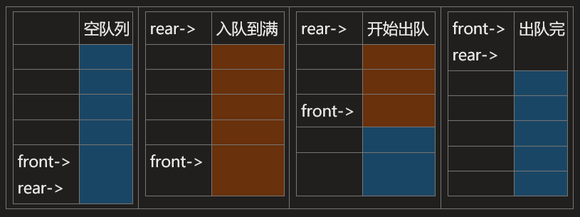

## 栈

只允许在一端进行插入或删除操作的线性表，Last In First Out, LIFO


共享栈: 两个栈共享一维数据空间  

```c
struct BiStack{
	int stack[size];
	int top[2];
}
```

链栈: 
```c
struct LinkStack {
	int data;
	LinkStack *next;
}
```

`卡特兰数 (Catalan Number)`: n个不同元素进栈，出栈序列的个数为 `1/(n+1) * C_n^2n`


## 队列

只允许在一端输入，在另一端输出的线性表 First In First Out，FIFO




`循环队列`

通过取余操作来实现空间再利用  

EnQueue:  `rear = (rear + 1) % Size;`  
DeQueue:  `front=(front + 1) % Size;`  
元素个数:  `(rear - front + 1) % Size`  

判队满: 
1. 用一个空单元进行判别: (rear + 1) % Size == front
2. 存放元素length
3. 存放tag， 入队 tag == true && read == front 队满，false并相等队空


`双端队列`

双端队列: 在两端都可以插入删除的线性表  
输入受限的双端队列: 一端入，两端出  
输出受限的双端队列: 一端出，两端入  

入队序列为1-n  

输入受限的双端队列不能得到的输出序列:   
输入受限，元素排列如下表所示，输出只能从左或者从右，也就是说无法隔位输出，输出6之后不可能跟4, 3, 2  

|||||||
|-----|-------|---|---|---|---|
| 6   | 5     | 4 | 3 | 2 | 1 |
| 第i位 | 第i+1位 |

第i位为6时，只能输出5或者1  
第i位为5时，只能输出4或者1  
即 `Q[i] - Q[i+1] == 1 || Q[i+1] == 1`  

输出受限的双端队列不能得到的输出序列：  
输出受限，只看输入排列，假设输入1，那么2肯定要在1的左边或者右边  
例如4,1,3,2 或者 4,2,3,1,5 这样的是无法输入的  
就是说不能有某个元素左右同时比它大2以上  
`abs(Q[i+1] - Q[i]) <= 1 && abs(Q[i-1] - Q[i]) <=1`

## 栈和队列的应用

1. 栈求括号匹配
1. 用队列对树进行层次遍历
2. 主机与外部设备速度不匹配：用队列做缓冲区
3. 多用户资源竞争：分配队列
4. 栈：进制转换，迷宫求解，深度优先搜索
1. 队列：页面替换，广度优先搜索
2. 用栈表达式求值
	
通过将中缀表达式转为后缀表达式，再导入栈进行运算
`A+B * (C - D) - E/F-> ABCD-*+EF/-`

| op  | # | ( | *, / | +, - | ) |
|-----|---|---|------|------|---|
| isp | 0 | 1 | 5    | 3    | 6 |
| icp | 0 | 6 | 4    | 2    | 1 |

isp: in stack priority  
icp: in coming priorty
- isp(s[top]) < icp(op) 进栈
- isp(s[top]) > icp(op) 退栈并输出
- isp(s[top]) == icp(op) 退栈并消失

## 矩阵的压缩存储

数组是线性表的推广
一维数组是一个线性表  
二维数组是一个线性表的线性表  
n维数组是受到n个线性关系得约束，在n个线性关系中得序号成为元素的下标  

压缩存储：多个值相同的只做一个存储，零元素不存储  

1. 对称矩阵
2. 三角阵
3. 三带状矩阵（对角阵） （我觉得可以前后补0，对齐存储）

`稀疏矩阵`，三元组（行标，列标，值）  