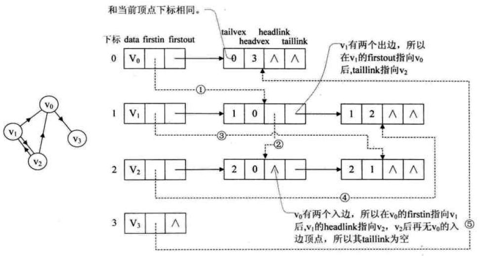
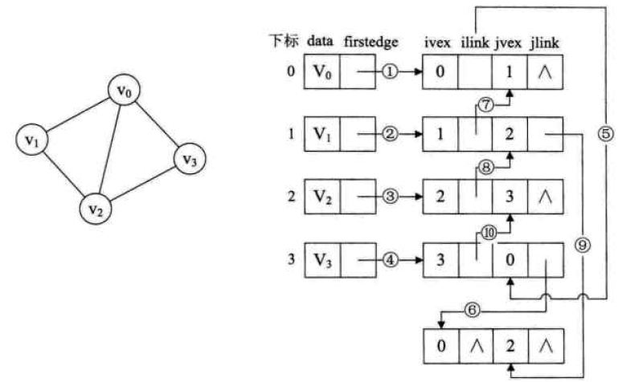
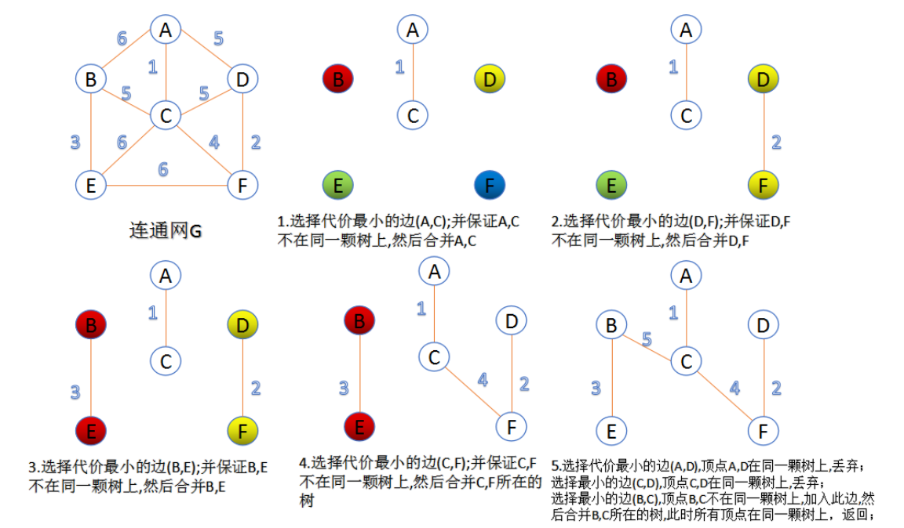
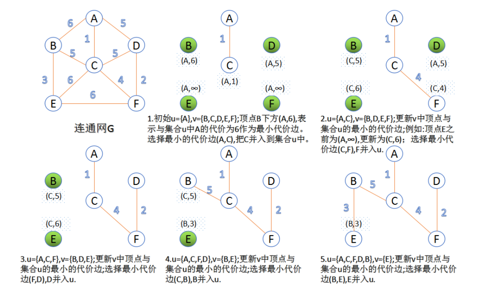

## 定义

`图`: 由点集V和边集E组成，边集可以为空，点集不能为空。  
`无向图`: 两个点之间的边不分方向
`有向图`: 两个点之间的边有方向，可以同时存在a到b和b到a的  
`网`: 边上有权值的图  


`简单图` : 不存在重复的边，不存在顶点到自身的边  
`多重图`: 简单图的反义词，两个顶点之间的同向边可以有多条，允许顶点到自身的边  


`弧`: 有向边，<v, w>，v为弧头，w为弧尾  
`度`: 一个顶点的边的数目，TD(V), 入度ID(V)，出度OD(V)。   
- 无向图: ∑▒〖TD(V_i)〗=2E
- 有向图: ∑▒〖ID(V_i )=E, ∑▒〖OD(V_i )=E〗〗


`路径`: 从图中一个点到另一个点经过的边的集合  
`路径长度`: 路径上面边的数目  
`简单路径`: 顶点不重复的路径  
`简单回路`: 顶点不重复的回路（回路不是路径）  
`连通`: 无向图中两个顶点有路径  
`强连通`: 有向图中两个顶点间有双向路径  


`完全图`: 对于无向图，任意两个顶点都存在边，一共有(n∗(n−1))/2 条边；对于有向图，任意两个顶点存在方向相反的两条边，一共有n∗(n−1)条边  

`子图`: 有G(V,E)，G′(V^′,E′)，V‘为V的子集，G’为G的子集，E‘为E的子集，且G‘是个图，则G’为为G的子图
生成子图: 若V'=V，则G'为G的生成子图  

`(强)连通图`: 图中任意两顶点都连通  

`极大连通子图`: 一个连通子图，而且并不是这个图的其他连通子图的子图…  
`连通分量`: 连通图的连通分量是其自己；非连通图的连通分量是各个连通块  
`极小连通子图`: 保持图连通的边数最小的连通图  

`生成树`: 一个极小连通子图，顶点数为n，边数为n-1
- 对连通图，砍去一边则不连通，加上一边则有回路
- 对非连通图，各个连通分量的生成树会构成生成森林

`有向树`: 一个顶点的入度为0，其他顶点入度都为1的树  

`稀疏图`: |E|<|V|∗log⁡|v|  

### 存储方式


`邻接矩阵法`: 用|E|大小的方阵来表示边的存在，A[i][j]中存储的值表示边<i,j>的情况: 
- 0: 顶点到本身的距离
- ∞: 不存在边
- 其他数字: 权值


`十字链表法`
```c++
struct CrossedLinkGraph {
	Node List[size];
	int vexNum, arcNum;
}
struct vextex {
	int data;
	arcNode* firstin;  // 第一条入边
	arcNode* firstOut; // 第一条出边
}
struct arcNode{
	int tailvex, headvex; // 头尾顶点
	arcNode* headlink, taillink; // 指向弧头弧尾相同的下一条弧
	int weight;
}
```
	
`邻接多重表`: 与十字链表相似
```c++
	struct AdjMultiGraph{
		Node nodeList[size];
		int vexNum, arcNum;
	}
	struct vextex {
		int data;
		arcNode* firstEdge;  // 第一条边
	}
	struct arcNode{
		bool mark; // 是否被搜索过
		int vexi, vexj; 两端的顶点
		arcNode* ilink, jlink; // 指向弧头弧尾相同的下一条弧
		int weight;
	}
```

`邻接表法`：每个顶点作为一个链表，后面接下一条边指向的顶点
```c++
struct AdjList{
	Node* [Size];
	int vexNum, arcNum;
}
struct Node {
	vertex vert;
	Node* next;
}
```







### 图的操作

```c
IsAdjacent(x, y);
NeighborEdge(x);
InsertVertex(x);
DeleteVertex(x);
AddEdge(i, j);
FirstNeigborVertex(x);
NextNeigborVertex(x, e);
EdgeValue(i, j);
SetValue(i, j);
```


`广度优先遍历 Breadth First Search, BFS`
- 与树的层次遍历一样，就多了个visit数组，把未visit的NeigborVertex全入队，再出队遍历即可
- 可以求图内所有点到单点的最短路径
	
`深度优先遍历 Depth First Search, DFS`
- 和树的先序遍历一样，查未在visit中的邻接点入栈，出栈访问


- 两种遍历都可以通过函数调用数（B/DFSTraverse() 中调用B/DFS()的次数）来确定连通分量数，（强）连通图可以一次遍历完
- 遍历的过程可以生成广度优先生成树或深度优先生成树，不连通则会生成森林


|存储方式|	适合何种图|	空间复杂度|	度|	出度|	入度|	下一条边|	遍历邻边|	查两顶点间边是否存在|	BFS|	DFS|
|---|---|---|---|---|---|---|---|---|---|---|
|邻接矩阵法|	有向图，无向图|	O(V^2)|	O(V^2 )|	O(V)|	O(V^2 )|	O(V)|	O(V)|	O(1)|	O(V^2 )|	O(V^2 )|
|邻接表法	|有向图，无向图|	O(V+2E)|	O(V+E)|	O(1)|	O(V+E)|	O(1)|	O(1)|	O(V+E)|	O(V+E)	|O(V+E)| O(V+E)|
|十字链表法	|有向图|	O(V+E)|	O(1)|	O(1)|	O(1)|	O(1)|	O(E)|	O(E)|	O(V+E)|	O(V+E)|
|邻接多重表	|无向图|	O(V+E)|	O(1)|	O(1)|	O(1)|	O(1)|	O(E)|	O(E)|	O(V+E)|	O(V+E)|


## 图的应用


### `最小生成树 Minimum Spanning Tree, MST`
加权连通图中，权值和最小的生成树，生成树不唯一，但最小权值和唯一
- |E|=|V|−1，再加一条边就会成环


`Prim 算法`

适用于求解采用邻接矩阵储存的稠密图  

设置集合S，把起始顶点放入S，每一次循环中去找以S中顶点为弧头，未在S中的顶点为弧尾的边集中最小的边，并将其弧尾加入S。



`Kruskal 算法`  

一开始把每个节点算作单个的连通分量，每一步然后找到权值最小的两个连通分量之间的边，将两个分量连起来，最后只剩下一个连通分量时即为最小生成树。

- 适用于稀疏图
- 可以用堆来存放边的集合，每次找权值最小的边仅需要o(log⁡E)
- 用并查集来描述连通分量集合，整个算法时间为O(E log⁡E  )




### `带权最短路径 The shortest path`

`Dijkstra算法`
用于求解单源最短路径，首先将源点加入集合S，建立一个dist数组，表示其他顶点离原点的距离；每一个循环，先计算新加入S的点连接到的点离源点的距离，更新dist，再取dist中不在集合S中的最小的点加入S。  
例如右图，先将V1加入S，然后更新dist，V3为10，V5为30，V6为100，其他为∞，最小的为V3，将V3加入S；循环2，V3为新加入s的点，连接到V4，V4离源点的距离为dist[v3] + <v3, v4> = 60，更新dist中V4为60，此时dist中最小的为V5，将V5加入S，继续循环。  


- 可以保存一个path数组，存放每个点的前驱结点
- 与Prim相似，都是将S的补集中离目标值最小的顶点加入S
- 时间复杂度为O(V^2 )，空间复杂度为O(V)。（邻接矩阵和邻接表）
- 可以用来求所有点的最短路径，时间复杂度为O(V^3 )


`Floyd-Warshall算法`

用邻接矩阵存储图，对于每一对顶点 u 和 v，看看是否存在一个顶点 w 使得从 u 到 w 再到 v 比己知的路径更短。如果是更新它…算法较为简洁，可以根据右边的图手动模拟计算过程

```c
 for(k=0;k<n;k++)
      for(i=0;i<n;i++)
         for(j=0;j<n;j++)
             if(A[i][j]>(A[i][k]+A[k][j]))
                   A[i][j]=A[i][k]+A[k][j];
```			
依次扫描每一点(k)，并以该点作为中介点，计算出通过k点的其他任意两点(i,j)的最短距离。


### `拓扑排序 Topology Sort`

对`有向无环图（Directed Aryclic Graph，DAG）`进行的排序，排序结果表示：如果顶点A在顶点B前面，则图中不存在顶点A到顶点B的路径。
排序方法：找一个没前驱的顶点，从图中删除这个顶点及相应的边，反复循环到图空
- 时间复杂度O(V+E)
- 按拓扑排序的顶点序列生成的邻接矩阵是三角阵，可以用于压缩存储
如果邻接矩阵是三角阵，肯定存在拓扑序列


### `关键路径 Critical Path`

用顶点表示事件，弧表示活动，弧上的权值表示活动持续时间的带权有向无环图叫AOE网（Activity on Edge Network）  

- 只有在某顶点所代表的事件发生后，从该顶点出发的各有向边的活动才能开始。
- 只有在进入某一顶点的各有向边所代表的活动都结束，该顶点的事件才能发生。
- 存在唯一的入度过为0的开始顶点和唯一的出度为0的顶点，称为原点和终点
	
1. 关键路线是从始点到终点的项目路线中耗时最长的路线，
2. 关键路线上所有活动的持续时间加起来就是项目的工期。
3. 可以通过缩短所有关键路径共同的关键活动来减少项目工期。

求解关键路径的过程
1. 求ve[i]，顶点的最早发生时间，按拓扑序列求该点前置路径的最大值
	`Ve(k)=max{ve(j)+dut(<j,k>)} `
2. 求vl[i]，顶点的最晚发生时间，按拟拓扑序列求该点后面的点减去路径权值的最小值
	`vl(j)=min{vl(k)-dut(<j,k>)}`
3. 求e[i]，边的最早发生时间，为该边起始顶点的最早发生时间
	`e[i] = ve(j), i左右两侧顶点为<j, k>`
4. 求l[i]，边的最晚发生时间
	`l[i] = vl[k] - <j, k>，i左右两侧顶点为<j, k>`
5. l[i] - e[i] 为0的边就是关键路径


