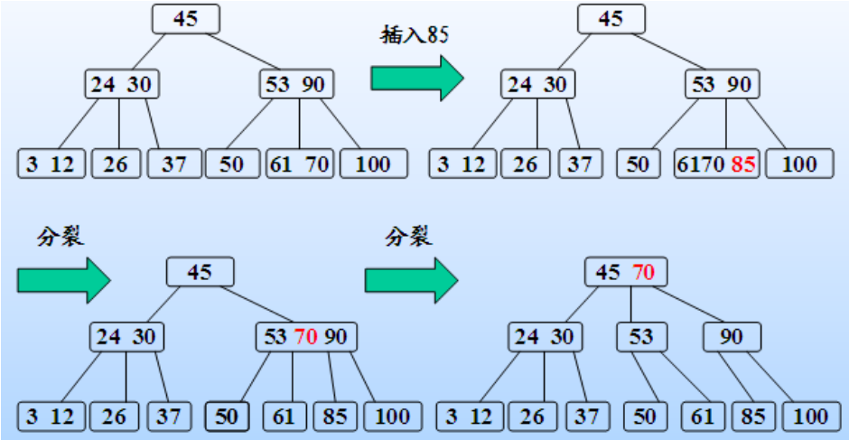
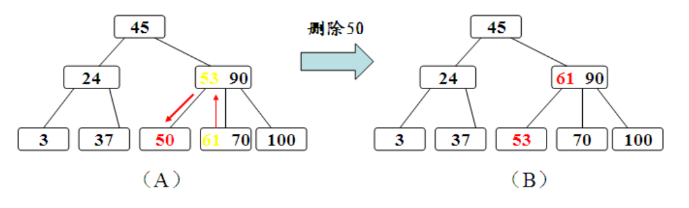
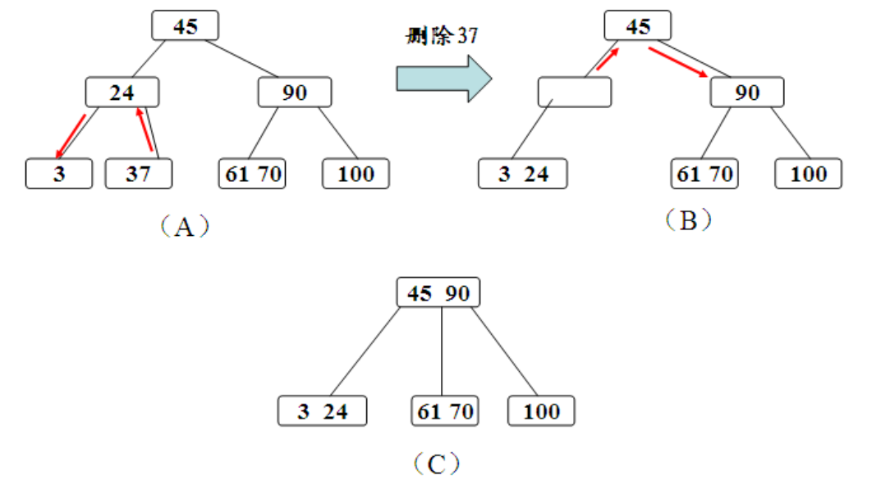

## 概念
`查找`: 在数据集合中满足某种条件的数据元素的过程。
                   查找表↑            ↑关键字
`静态查找表`: 只做查找和查看元素属性，例如顺序查找，折半查找，散列查找
`动态查找表`: 还匀速插入和删除，列入二叉排序树，B树

`平均查找长度`: ASL=∑_(i=0)^n▒〖P_i C_i 〗，P_i 为查找第i个数的概率，一般为1/n， C_i 为查找到它的次数

查找表查找概率不一样时,可以对表中成员按概率从大到小进行排序


| 查找方式           | 成功的ASL              | 失败的ASL   | 说明                                               |
| :----------------- | :--------------------- | :---------- | :------------------------------------------------- |
| 顺序查找           | (n+1)/2                | n+1         |                                                    |
| 有序表的顺序查找   | (n+1)/2                | n/2+n/(n+1) |                                                    |
| 二分查找           | log_2⁡〖(n+1)〗−1      |             | 通过判定树层高计算ASL                              |
| 顺序查找的分块查找 | (S^2+2S+n)/2S          |             | 总共有n个，块大为s，总共b块，b=[n÷s]，理想块长s=√n |
| 二分查找的分块查找 | [log_2⁡(n+1) ]+(s+1)/2 |             | 理想块长为s=[log_2⁡n]                              |
|                    |                        |             |                                                    |


`有序表的顺序查找`  

假设从小到大的顺序表，从前往后查，查到失败的就可以停止了


`折半查找`
一定要熟练写这段 
```c
while(low <= high) {
	mid = (low + high) / 2;
	if ( A[mid] == key)
		return A[mid];
	else if (A[mid] <= key) {
		low = mid + 1;
	} else {
		high = mid - 1;
	}
}
if (low <= size)
	return low;
```


## 应用

### `B树，多路平衡查找树，Multiway Balanced Search Tree`

用于在磁盘中查找和读写数据，通常层数少，每层映射到磁盘盘片旋转和磁臂移动的操作  
m阶b树定义: 可为空树，可为m叉树（可以没有度为m的节点）
1. 根节点至少有两棵子树
2. 每个节点最多m棵子树，m−1 个关键字
3. 除了根节点外的叶节点至少有[m/2]棵子树，[m/2]−1个关键字
4. 叶节点全都在同一层，其中不存信息，代表查找失败

节点定义: 关键字k从小到大排列，p_(i−1)<k_i  ,p_i>k_i

|||||||
| :-- | :-- | :-- | :-- | :-- | :-- |
| n   | k_1 | k_2 | k_3 | …   | k_n |
| p_0 | p_1 | p_2 | p_3 | …   | p_n |

- 关键字为n的B树，叶节点共有n+1个
- h层的B树，关键字范围为[2[m/2]^(h−1)−1 , m^h−1]
- h层的B树，节点个数范围为[1+2([m/2]^(h−1)−1)/([m/2]−1),(m^h−1)/(m−1)]
- 范围左侧对应于第一层1个节点，第二层两个节点，从第二层开始每个节点只包含[m/2]−1个关键字
范围右侧对应于严格m叉树（每个节点都有m个子树）


`B树的插入与删除`

- 插入: 从中间分裂，把中间的往上移，如果上层也溢出，则接着分裂往上  
- 删除: 
	1. 若删除的不在除叶节点外的最底层
		1. 若小于k的子树的关键字数量大于[m/2]−1，则用子树中最大的代替k
		1. 若大于k的子树的关键字数量大于[m/2]−1，则用子树中最小的代替k
		1. 若都不够，合并左右子树，直接删除k
	2. 若删除的在除叶节点外的最底层
		1. 若该节点关键字大于[m/2]−1，直接删除k
		1. 若关键字个数等于[m/2]−1，且左右兄弟有一个数量大于[m/2]−1，则将父亲的关键字下移，兄弟节点的关键字上移
		1. 若兄弟节点的数量也不够，则将该节点合并到兄弟节点中，将父亲节点的关键字下放，若父亲节点不满足要求，则向上回溯


### B+树

- 叶节点包含关键字,叶节点从小到大排列,并串成了链表
- 分支节点包含了子树的关键字最大值和指针
- 可以存下最小的叶节点进行顺序查找

B树与B+树的区别

|             | B树                | B+树                   |
| :---------- | :----------------- | :--------------------- |
| 关键字为n时 | n+1棵子树          | n棵子树                |
| 关键字范围  | [[m/2]−1,m−1]      | [[m/2],m]              |
| 叶节点      | 空的，代表查找失败 | 存储信息，并串成了链表 |
| 关键字      | 不重复             | 重复                   |







### `散列表 Hash Table`
`散列函数`: 一个把查找表的关键字映射成对应地址的函数  
- Hash(key) = Addr (下标，索引，内存地址)
`散列表`: 建立了关键字和存储地址之间的直接映射，使得时间复杂度o(1)  
`冲突/碰撞`: 散列函数把两个或两个以上的关键字映射到了同一地址  
`同义词`: 发生了冲突的关键词  

散列函数要求: 
1. 计算简单
2. 等概率，均匀地，减少冲突
3. 值域范围大于地址范围

`装填因子`: α=表中记录数/散列表长度  
平均查找长度依赖于α，计算公式（非公式公式）ASL=(1+1/(1−α))/2

`散列的方法`
1. 直接定址法:  H(key)=a×key+b
2. 除留余数法:  H(key)=key % p
3. 数字分析法:  r进制数，取数码分布均匀的若干位为地址
4. 平方取中法: 平方值的中间几位，适用于关键字每一位取值不够均匀，或均小于散列地址所需的倍数
5. 折叠法: 将关键字分割成位数相同的几部分，取每部分的叠加和作为地址，适用于位数多，每位数字均匀分布时

`处理冲突的方法`
1. 开放定址法: H_i=(H(key)+d_i )%m ，不能随便删除元素
	1. 线性探测法: d_i=1,2,3…m−1 ，等同于往后填充
	1. 平方探测法: d_i=1^2,〖−1〗^2,2^2,−2^2…k^2,−k^2    k≤m/2，m为可以表示成4k+3的质数
	1. 再散列法: d_i=Hash_2 (key)，又称作双散列法
	1. 伪随机序列法: d_i 伪随机序列
2. 拉链法: 同义词放在线性链表中，适用于经常进行插入或删除的情况


	
### 字符串匹配 

`简单匹配法`：线性查询，查子串错了就后退，o(mn)  

`KMP算法`，The Knuth-Morris-Pratt Algorithm
- 提前算好一个Next数组，失配时，主字符串指针不变，匹配串指针到next[j]

KMP主过程
```c++
while(i < size) {
	if( j == 0 || s[i] == t[j] ) {
		++i;
		++j;
	} else
		j = next[j];
}

// 计算next的过程
next[1] = 0; next[2] = 1;
for(int i = 3; I <= size; ++i) {
	fail = next[i - 1];
	while(fail != 0) {
		if(s[i-1] == s[fail]) {
			next[i] = fail + 1; break;
		} else
			fail = next[fail];
	}
	if(fail == 0)
		next[i] = 1;
}
```


模拟求解next过程

|      |     |     |     |     |     |     |     |     |
| :--- | :-- | :-- | :-- | :-- | :-- | :-- | :-- | :-- |
| i    | 1   | 2   | 3   | 4   | 5   | 6   | 7   | 8   |
| S    | a   | b   | a   | a   | b   | c   | a   | c   |
| next | 0   | 1   | 1   | 2   | 2   | 3   | 1   | 2   |


| i   | i-1 | s[i-1] | fail=next[i-1] | s[fail] | result                       |
| :-- | :-- | :----- | :------------- | :------ | :--------------------------- |
| 3   | 2   | b      | 1              | a       | b != a; fail = next[1] = 0;  |
|     |     |        | 0              |         | next[3] = 1;                 |
| 4   | 3   | a      | 1              | a       | a == a; next[4] = 1 + 1 = 2; |
| 5   | 4   | a      | 2              | b       | a != b; fail = next[2] = 1;  |
|     |     |        | 1              | a       | a == a; next[5] = 1 + 1 = 2; |
| 6   | 5   | b      | 2              | b       | b == b; next[6] = 2 + 1 = 3; |
| 7   | 6   | c      | 3              | a       | c != a; fail = next[3] = 1;  |
|     |     |        | 1              | a       | c != a; fail = next[1] = 0;  |
|     |     |        | 0              |         | next[7] = 1;                 |
| 8   | 7   | a      | 1              | a       | a == a; next[8] = 1 + 1 = 2; |
