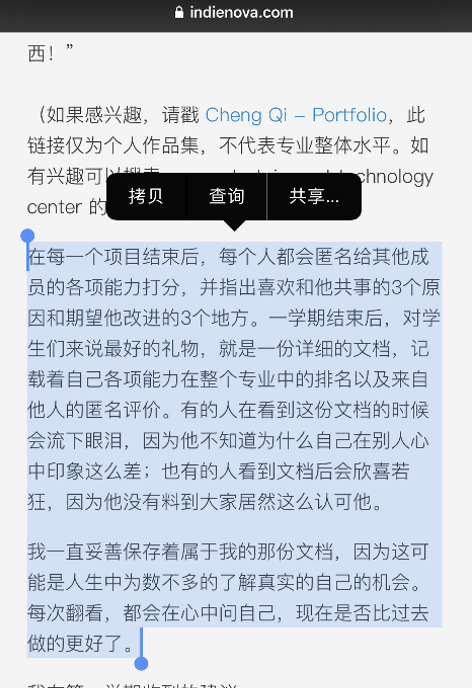
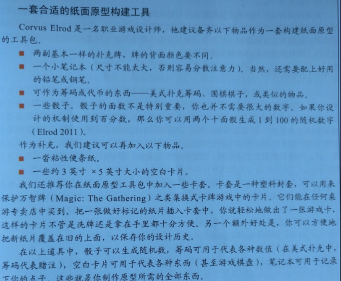
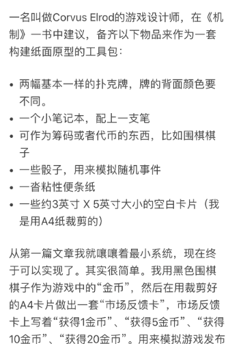
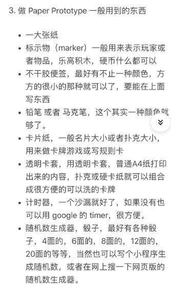

## 自我管理

> 进步原则是一种研究事实, 它表明, 对优秀的内在工作状况贡献最大的一点是: 每天所取得的有规律和可见的进步.

进度的频率比大小更重要. 如果想要保持动力十足的状态, 只需要一些微小的成就感就可以了. 例如解决了一个算法问题, 完成了一个动画, 或是QA注意到了一个细节等等. 这些细微的成就仍然可以激励开发者每天投入其中.

可以通过一些手段将进步更加频繁可见, 例如将完成的任务内容截图, 将这些截图列在墙上.

## 团队合作

- 摘自Indienova ChengQi

## 纸面原型

